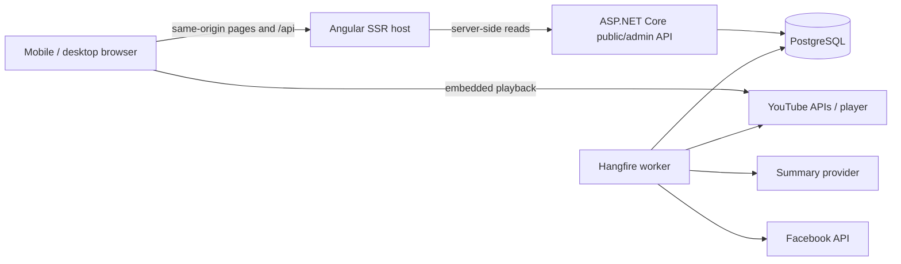

# Frontend Technical Architecture

Status: proposed
Last updated: 2026-07-18

## 1. Current repository assessment

The solution has a sound starting separation:

- `ContentAggregator.Core`: EF-backed entities and enums.
- `ContentAggregator.Application`: workflow interfaces, models, and orchestration.
- `ContentAggregator.Infrastructure`: PostgreSQL repositories and external adapters.
- `ContentAggregator.API`: controller host and HTTP contracts.
- `ContentAggregator.Worker`: Hangfire jobs for discovery, subtitles, summarization,
  Facebook publishing, and YouTube comment publishing.

The worker/API split and explicit response records are good foundations. The frontend is
not blocked by project structure, but it is blocked by the shape and governance of the
public data.

### Relevant gaps

1. `GET /api/YoutubeContents` supports only `page`, `pageSize`, and `channelId`.
2. Its item contract mixes reader data with operational fields such as `FbPosted`,
   `YoutubeCommentPosted`, and `LastProcessingError`.
3. There is no video-detail public endpoint, facet-count endpoint, search suggestion
   endpoint, or structured chapter response.
4. `Feature` actually represents a person and only contains four required name parts.
   It has no slug, aliases, role, description, image, verification, or merge state.
5. There is no topic/subject/format taxonomy. Channel title keywords are discovery input,
   not content tags.
6. `VideoSummary` and `YoutubeCommentText` are unversioned strings on the video row.
   Section timestamps cannot be queried, corrected, or rendered safely as structured UI.
7. Participant extraction is comma/space splitting plus last-name matching. It will
   produce ambiguous and missed links, especially across scripts and compound names.
8. Public visibility is inferred from `NotRelevant` and summary presence. There is no
   draft/review/published state or publication timestamp.
9. API write endpoints and operational data have no application authentication or
   authorization.
10. CORS is hard-coded to `https://localhost:7084`, which will not match a normal Angular
    development or production deployment.
11. There are no automated test projects visible in the solution.
12. The Dockerfile can publish API or worker through build arguments, but the future web
    SSR process and a production reverse-proxy topology are not defined.
13. External publishing is activated by configured credentials plus row booleans/string
    presence. There is no global destination kill switch, immutable approved command, or
    idempotency key for either YouTube comments or Facebook posts.
14. `YtDlpSubtitleDownloader` obtains captions through `yt-dlp`; transcript provenance,
    rights basis, retention/revocation terms, and Made-for-Kids handling are not modeled.
15. YouTube comment text is truncated to 900 characters during workflow execution. This
    can cut a timestamp line or disclaimer after approval and makes the posted payload
    differ from any preview.

Do not compensate for these gaps with client-side parsing, filtering an already paged
response, or hard-coded taxonomy JSON. Those approaches will fail as soon as the corpus
grows or an editor corrects machine output.

## 2. Stack decision

### Recommendation: Angular 22

Use the current supported Angular major when implementation starts (Angular 22 as of
this document), with:

- strict TypeScript and strict Angular template checks;
- standalone components and route-level lazy loading;
- Signals for local/view state and RxJS for HTTP/event streams;
- Angular SSR/hybrid rendering and hydration;
- Angular Router with URL-owned search/filter state;
- Angular CDK and selectively themed Angular Material controls;
- SCSS plus CSS custom-property design tokens;
- an OpenAPI-generated API client;
- Vitest for unit/component tests and Playwright for end-to-end/responsive tests;
- ESLint, Prettier, and CI-enforced type/lint/test/build checks.

Angular is a strong fit here, not just a portfolio keyword. The product has complex forms,
facets, routing, localization, a future protected operations surface, and a .NET API with
explicit contracts. Angular demonstrates structured frontend engineering and provides an
integrated router, HTTP stack, DI, forms, accessibility primitives, and SSR.

React/Next.js would also be credible and has a broader UI ecosystem, but it would require
more discretionary library choices and would add a second server framework without a
clear product benefit. Blazor would maximize C# reuse but provide less evidence of modern
TypeScript frontend skill for the stated portfolio goal. Angular is therefore the
recommended decision unless the target jobs are specifically React-only.

Avoid NgRx initially. Signals plus small route-scoped stores are sufficient for filter,
result, and review state. Introduce a global state library only when cross-route state,
offline mutation queues, or debugging needs become concrete.

### Version policy

- Pin exact toolchain versions through the lockfile and use an active Node LTS supported
  by the selected Angular release.
- Schedule Angular major upgrades at least twice per year; do not leave the application
  on an unsupported major for portfolio convenience.
- Do not base production architecture on Angular experimental/developer-preview APIs.

Official references:

- [Angular version compatibility](https://angular.dev/reference/versions)
- [Angular hybrid rendering](https://angular.dev/guide/prerendering)
- [Angular Signals](https://angular.dev/guide/signals)
- [Angular testing](https://angular.dev/guide/testing)

## 3. System context



Production should expose one origin through a reverse proxy:

- `/` and static assets to the Angular SSR host;
- `/api/*` to ASP.NET Core;
- no public route to the worker or Hangfire dashboard.

Same-origin routing avoids a fragile list of CORS origins. Retain a configurable CORS
policy only for explicitly supported local or external clients.

## 4. Bounded surfaces

### Public read surface

- Anonymous, cache-friendly, rate-limited reads.
- Only reviewed and published content.
- Stable, versioned contracts under `/api/v1/public`.
- No processing errors, tokens, provider payloads, raw SRT, or external-publication state.

### Editorial surface

- Authenticated and role-authorized under `/api/v1/admin`.
- Draft/review/publish transitions, corrections, taxonomy management, retries, and audit
  history.
- Anti-forgery protection when cookie authentication is used.
- External publishing is a distinct permission and action from site publication.
- Existing unauthenticated operational endpoints are protected or removed before the API
  is exposed outside a trusted development environment.

### Pipeline surface

- Worker-owned state transitions and artifacts.
- Idempotent jobs with per-stage attempt/error records.
- No frontend access to Hangfire storage. Expose an intentional admin projection instead.
- Every external destination is disabled by default at both job registration and workflow
  execution. Credentials establish identity, not permission to publish.
- A publish job consumes a destination-specific, immutable approved command containing
  the exact final payload/artifact revision, operator, destination, approval time, and
  idempotency key. It rejects an over-limit payload before approval and never silently
  truncates or rewrites one during execution.

This separation is logical; it does not require new .NET projects immediately. Add
feature folders/contracts within the current layers first.

## 5. Data model evolution

Names are illustrative; preserve migrations and existing IDs where feasible.

### Orthogonal content state

Do not represent lifecycle with one enum. A published video can simultaneously have a
failed metadata refresh, an unavailable source, and a still-valid last approved summary.
Model separate axes:

- `SourceAvailability`: `Unknown`, `Available`, `Private`, `Removed`, `RegionRestricted`,
  with last checked time and Made-for-Kids/audience status where applicable;
- per-stage `ProcessingAttempt`: stage, state, input revision/checksum, attempt number,
  started/completed times, error, and retry disposition;
- `EditorialReviewState`: `Draft`, `ReadyForReview`, `ChangesRequested`, `Approved`,
  `Rejected` for an immutable content revision;
- `SitePublicationState`: `Unpublished`, `Scheduled`, `Published`, `Withdrawn`, with
  timestamps, reason, and the exact approved revision ID;
- separate destination publication commands/states for Facebook and YouTube.

Store `LastMetadataSyncedAt`, source description, thumbnail variants, metadata ETag when
allowed, canonical content language, and format. `NotRelevant` migrates to a reviewed
rejection reason rather than competing with public visibility. Reprocessing creates a new
draft and never silently replaces or unpublishes the last approved public revision.

### Transcript provenance

Create a source/provenance record for every transcript: acquisition method, source URI,
rights category, consent/license reference, retention/revocation terms, acquired time,
language, and checksum. Only owned, creator-consented/licensed, or explicitly authorized
transcript sources may progress to publication. Unknown provenance is a hard publication
block. Removal, consent revocation, retention expiry, and Made-for-Kids restrictions flow
to an auditable withdrawal/deletion process.

### Generated analysis

Create an immutable/versioned `ContentAnalysis` (or equivalent):

- content ID, language, summary, generator/model, prompt/schema version;
- created time, review state, reviewer, superseded version;
- source transcript checksum so stale outputs can be identified;
- structured quality/error metadata rather than an error mixed into public content.

The published video points to an approved analysis version. Editors can correct output
without losing provenance or overwriting the previous result.

### Sections

Create `ContentSection`:

- ID, analysis/content ID, ordinal;
- `StartSeconds`, optional `EndSeconds`;
- localized heading and optional section summary;
- generation confidence, source (`Machine`/`Editor`), review state.

Validate monotonic timestamps, non-overlap when end times exist, video duration bounds,
and a non-empty heading. Render and publish comment text from these rows. Do not parse the
comment string back into sections.

Section-based outlines should be generated first. If minute notes are required, store
them as a separate artifact or granularity rather than creating dozens of
indistinguishable top-level chapters.

### People

Evolve `Feature` to `Person` through a controlled migration:

- stable ID, localized current slug, and slug history;
- localized display names rather than mandatory first/last assumptions;
- aliases with normalized search values and language/script;
- optional editor-authored description and image rights/source;
- merge target and verification state.

Create `ContentPerson` with role (`Host`, `Guest`, `Speaker`, `Mentioned`, `Unknown`),
confidence, extraction source, and review state. Do not automatically equate every last
name mention with a participant.

### Topics and formats

Create controlled `Topic` and `ContentTopic` records:

- localized name, current slug and slug history, optional parent, description,
  active/merge state;
- relationship confidence, extraction source, and review state.

Keep `ContentFormat` as a small controlled enum/table. A topic describes what a video is
about; format describes what kind of production it is. Avoid one generic tag table that
mixes people, subjects, channels, formats, and operational labels.

### Database search

Start with PostgreSQL:

- normalized searchable fields for title, channel, person aliases, topics, summary, and
  optionally approved section headings;
- full-text indexes using language-aware configurations where PostgreSQL supports them;
- `simple` tokenization plus `pg_trgm` indexes for Georgian names/text and typo-tolerant
  matching where a suitable built-in dictionary is unavailable;
- B-tree indexes for publication state/date, channel, language, format, and duration;
- join-table indexes in both useful directions;
- a denormalized search document/materialized projection only if query plans show it is
  needed.

Move to OpenSearch/Elasticsearch only after measured needs such as large corpus size,
complex multilingual ranking, highlighting, or operational query latency exceed what
PostgreSQL can reasonably provide.

## 6. Public API shape

Use a dedicated query object; validate limits and enum values at the boundary.

```http
GET /api/v1/public/videos
  ?q=economy
  &channel=UC123
  &channel=UC456
  &person=42
  &topic=12
  &topic=27
  &language=ka
  &language=en
  &format=interview
  &publishedAfter=2026-01-01T00:00:00Z
  &publishedBefore=2026-07-19T00:00:00Z
  &durationMin=600
  &durationMax=3600
  &sort=relevance
  &cursor=opaque-value
  &limit=24
```

Arrays always use repeated query keys. Within one facet, selections use OR; across facets
they use AND. Limit each facet to 20 values, normalize/deduplicate values before query
execution, and reject unknown values predictably. `publishedAfter` is inclusive and
`publishedBefore` is exclusive; the UI converts user-entered dates from its documented
display zone to RFC 3339 instants.

Sorts have deterministic tie-breakers: relevance then published time then immutable ID,
or the selected scalar sort then immutable ID. The opaque cursor is signed/versioned and
bound to the normalized query, filters, and sort; changing any of them invalidates it.

Recommended endpoints:

- `GET /api/v1/public/videos`
- `GET /api/v1/public/videos/{videoId}`
- `GET /api/v1/public/search/facets` with the active query/filter context
- `GET /api/v1/public/search/suggestions?q=`
- `GET /api/v1/public/channels/{id}`
- `GET /api/v1/public/people/{id}`
- `GET /api/v1/public/topics/{id}`
- `GET /api/v1/public/explore`
- `GET /api/v1/public/sitemaps/*` or server-generated sitemap equivalents

The video list item should contain only what cards render: immutable key, canonical URL,
title, thumbnail, duration, publication date, channel/source, short approved summary,
language, and a small set of people/topics. The detail response adds approved sections,
full summary, attribution, analysis disclosure, and related content.

Return facet counts derived from the same filtered universe as results. Do not load every
person/channel/topic into the browser and count locally.

Use opaque cursor pagination for stable feeds. Offset pagination may remain on small admin
tables where jumping to a page matters more than stability.

### Contract practices

- Publish OpenAPI in CI and generate the TypeScript client. Fail CI on unreviewed breaking
  changes.
- Return RFC 9457-style problem details consistently.
- Use strong/weak ETags and cache headers for public entities where appropriate.
- Admin drafts use `If-Match` with a row/revision version. Conflicts return the current
  revision and support an explicit compare/reapply flow rather than last-write-wins.
- Publishing is one transaction that atomically points the public record to the exact
  reviewed summary, sections, people, topics, and format revision.
- Keep public response records distinct from EF entities and admin contracts.
- Add API integration/contract tests before Angular depends on these endpoints.

## 7. Angular application architecture

Proposed workspace location: `ContentAggregator.Web/` at the repository root.

```text
ContentAggregator.Web/
  src/app/
    core/                 # config, auth session, HTTP interceptors, layout services
    shared/               # reusable presentational UI and accessible primitives
    features/
      discover/
      search/
      video-detail/
      channels/
      people/
      topics/
      explore/
      legal/
      admin/
    api/                  # generated client; never hand-edited
    app.routes.ts
    app.routes.server.ts
  src/styles/
    _tokens.scss
    _typography.scss
    _utilities.scss
```

Rules:

- Organize by feature, not by global `components/services/models` buckets.
- Lazy-load route features. Keep public and admin route trees separate.
- Smart route components own loading and URL synchronization; presentational components
  receive typed inputs and emit domain-level events.
- The URL is the source of truth for committed search state. A route-scoped Signal store
  derives view state and cancels stale requests through RxJS.
- Use Angular `HttpClient` transfer cache for eligible SSR reads and avoid a duplicate
  browser request after hydration.
- Wrap the YouTube IFrame API behind a browser-only adapter; do not access `window` or
  `document` during SSR.
- Use route resolvers sparingly. Stream noncritical related content after the primary
  title/summary response rather than blocking the whole route.
- Localize display strings through one selected SSR-compatible runtime i18n approach;
  keep content locale fields independent from UI locale.

### Locale contract

- Public routes are always prefixed with `/ka` or `/en`; `/` temporarily redirects using
  explicit preference/`Accept-Language`, with `ka` as the fallback.
- Entity IDs are locale-independent. Localized slugs are cosmetic and have redirect
  history; canonical and `hreflang` URLs use the correct locale/slug pair.
- SSR and CDN cache keys include route locale. API reads accept an explicit `uiLocale`
  (or a consistently applied `Accept-Language`) for localized labels, while content
  language remains a separate field/filter.
- Fallback order is requested UI locale, Georgian, English, then a clearly marked source
  value. The API returns the resolved locale so the UI can set correct `lang` attributes.
- Choose and configure a runtime-capable Angular localization approach before route and
  OpenAPI implementation; this is not left to individual components.

### Rendering strategy

- SSR: home, search landing/results, video, channel, person, topic.
- Prerender: methodology, terms, privacy, stable explore landing where feasible.
- CSR: all admin routes and post-hydration filter/navigation interactions.
- Defer/hydrate the player and below-the-fold related content where this improves mobile
  performance without creating layout shift.

## 8. Security and privacy

- Add server-side authentication before any admin UI. Prefer an established OIDC provider
  or ASP.NET Core Identity with secure, HTTP-only cookies; do not store bearer tokens in
  local storage.
- Roles/permissions: `Editor`, `Publisher`, `Administrator`. Site publication and external
  platform publication are separate permissions.
- Require confirmation and create an audit record for comments, posts, retries with side
  effects, and destructive taxonomy merges.
- Add a deployment-level and runtime kill switch per external destination. Both job
  scheduling and job execution enforce it; only an approved immutable command may publish.
- Store a refreshable OAuth credential securely on the server; the current static YouTube
  access-token option is not a sustainable authentication design.
- Apply CSP with explicit YouTube frame/script/connect sources, frame ancestors, and no
  unsafe script allowances unless unavoidable and documented.
- Use `strict-origin-when-cross-origin` or a current YouTube-compatible referrer policy for
  embedded-player identification.
- Rate-limit anonymous search/suggestions and bound query complexity.
- Sanitize any rendered rich text. Prefer plain structured text; never render model output
  through unsanitized `innerHTML`.
- Keep secrets out of Angular environment files; those are shipped to browsers.

Current YouTube requirements should be rechecked at implementation and release time:

- [YouTube API Services developer policies](https://developers.google.com/youtube/terms/developer-policies)
- [Required minimum functionality](https://developers.google.com/youtube/terms/required-minimum-functionality)
- [Embedded player parameters](https://developers.google.com/youtube/player_parameters)

## 9. Performance and observability

Initial budgets, refined with real content:

- LCP at p75 mobile: under 2.5s.
- CLS: under 0.1.
- INP at p75: under 200ms.
- Initial public-route JavaScript: enforce a CI budget and keep the player code out of the
  initial chunk where possible.
- API p95 for cached public list/detail reads: under 300ms at the service boundary.

Implementation practices:

- Responsive YouTube thumbnails with fixed aspect ratio and explicit dimensions.
- Lazy-load below-the-fold images and player implementation; never lazy-load the primary
  title or hide it behind client JavaScript.
- CDN-cache immutable assets and cache anonymous public API responses conservatively.
- Correlation IDs flow from SSR/browser through API; structured logs omit transcript and
  summary bodies by default.
- Trace pipeline stage duration and failures separately from public HTTP metrics.
- Capture frontend errors and Web Vitals with a vendor-neutral OpenTelemetry-compatible
  path where practical.

## 10. Test strategy

### Backend

- Unit tests for participant parsing replacement, section validation, orthogonal state
  rules, query normalization, destination length validation, and exact payload rendering.
- PostgreSQL integration tests for each facet combination, counts, ranking, soft/unavailable
  visibility, and cursor stability.
- API contract tests that assert no operational/private fields escape public endpoints.
- Workflow tests for transcript provenance gates, external destination kill switches,
  idempotency, approval payload immutability, retry behavior, and OAuth failure.
- Concurrency and transaction tests for conflicting edits, atomic revision publication,
  withdrawal, and a failed reprocessing pass that leaves the approved version public.

### Frontend

- Vitest component/store tests for filter serialization, result states, section seeks,
  locale formatting, and error recovery.
- Playwright journeys on 320px mobile, representative tablet, and desktop widths:
  search/filter/share URL, open video, copy/deep-link/seek a section, back with scroll
  restoration, and editor review/publish authorization. Cover safe-area insets, on-screen
  keyboard behavior, and landscape mobile for navigation, filters, and player controls.
- Automated accessibility scans plus manual keyboard and screen-reader checks for filters,
  dialogs, player context, and live result updates.
- SSR tests verify meaningful localized HTML, 404/410/5xx status behavior, canonical and
  `hreflang` tags, safe structured-data serialization, sitemap removal/`lastmod`, and
  hydration without duplicate fetches or console errors.
- Visual regression snapshots for the primary routes and long Georgian/English titles.

### CI gates

- .NET format/build/test.
- Angular format/lint/typecheck/unit test/production SSR build.
- OpenAPI client regeneration produces no unexplained diff.
- Playwright smoke suite and accessibility checks.
- Dependency and container vulnerability scans.

## 11. Delivery plan

### Phase 0: decisions and safety

- Confirm content rights/embedding interpretation and subtitle acquisition compliance.
- Define display locales and editorial roles.
- Protect or remove all existing operational endpoints and dashboards; add a thin
  authentication/authorization vertical slice before any shared deployment.
- Default-disable Facebook and YouTube writes at job registration and workflow execution.
  Define immutable approved publication commands, previews, per-destination permission,
  idempotency, and audit behavior.
- Approve an actual transcript acquisition policy: allowed source classes, recorded
  provenance/rights, retention/revocation, Made-for-Kids handling, and deletion flow.
- Record representative real content fixtures, including long Georgian titles and missing
  subtitles/summaries.

Exit: operational access is protected, external writes are technically off by default,
and policy assumptions include an accepted acquisition path rather than an unresolved
review item.

### Phase 1: public read foundation

- Add orthogonal source/processing/review/publication state, structured sections, people
  evolution, topics/formats, and metadata freshness.
- Migrate existing summaries/comment outlines without pretending unparseable text is
  structured data; mark it for review/regeneration.
- Implement public list/detail/facet/entity endpoints and database indexes.
- Deliver the minimal authenticated review/preview/publish flow needed to create an
  atomic approved public revision; the richer admin console remains Phase 3.
- Add API integration and contract tests.

Exit: API alone can answer every Release 1 public page with reviewed data, and an
authorized operator can safely produce that reviewed state.

### Phase 2: Angular public application

- Scaffold Angular SSR workspace, generated client, design tokens, layouts, routing, and
  localization foundation.
- Build Home, Search, Video, Channel, Person, Topic, Explore, and legal/methodology routes.
- Implement responsive filter rail/bottom sheet, URL state, structured metadata, and
  accessibility/performance instrumentation.

Exit: mobile and desktop public journeys pass CI against seeded representative data.

### Phase 3: complete editorial workflow

- Expand the Phase 0 authentication slice into complete admin contracts, session recovery,
  and least-privilege role management.
- Build review queue, video editor, structured section editor, taxonomy merge/alias tools,
  revision diff/restore/conflict handling, takedown queue, audit history, and controlled
  retries/external publication.

Exit: an editor can take a discovered video to public publication without database access.

### Phase 4: production hardening

- Reverse proxy, same-origin routing, SSR/container deployment, caching, rate limiting,
  CSP, monitoring, backups, and runbooks.
- Validate YouTube attribution/player behavior and legal pages on all target viewports.
- Load-test search and review PostgreSQL query plans before considering a search service.

Exit: defined SLOs, rollback path, policy checks, and operational ownership exist.

## 12. Architectural decisions and deferred choices

| Decision | Rationale |
| --- | --- |
| Angular 22 with hybrid rendering | Strong portfolio signal and good fit for public SEO plus complex admin UI |
| One Angular workspace, public/admin route boundaries | Reuse design/contracts without deploying two UIs prematurely |
| PostgreSQL search first | Existing infrastructure; adequate until measurements prove otherwise |
| Structured/versioned analysis | Enables review, correction, search, and safe rendering |
| Embed original video | Preserves attribution/playback integrity and avoids copying content |
| Approval before external writes | Adds user control, auditability, and policy risk containment |
| No accounts/personalization in R1 | Not needed to prove the core discovery value |
| No microservices, MediatR, generic repository, or NgRx by default | None solves a demonstrated current constraint |

Revisit only with evidence:

- dedicated search engine;
- separate public and admin frontend deployments;
- BFF distinct from Angular SSR;
- real-time job updates via SignalR;
- vector search/embeddings;
- multi-tenant editorial teams.
